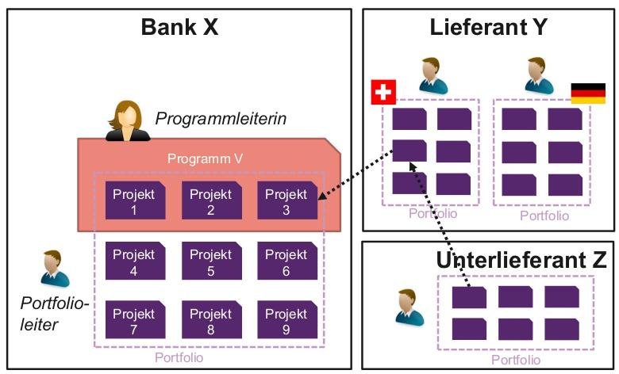
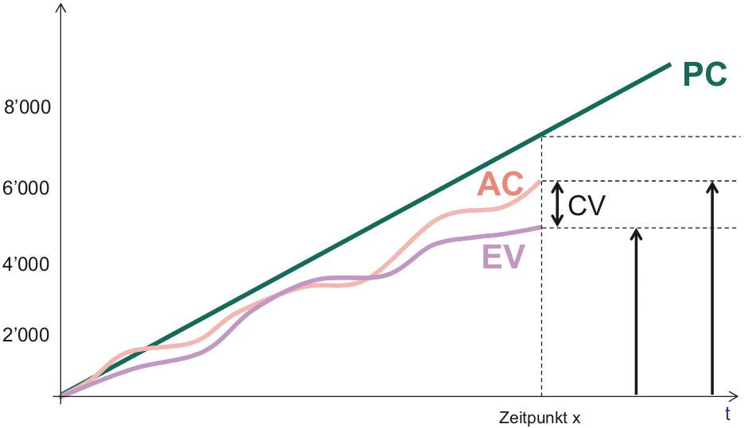
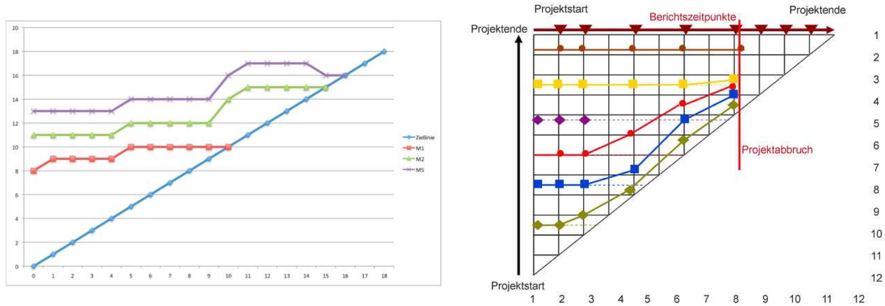
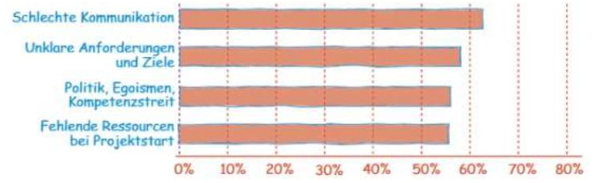
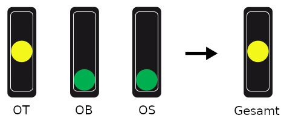
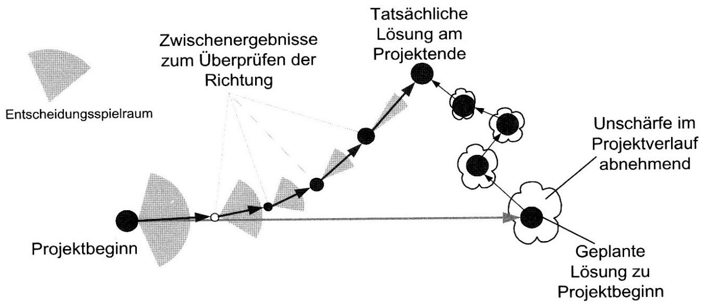
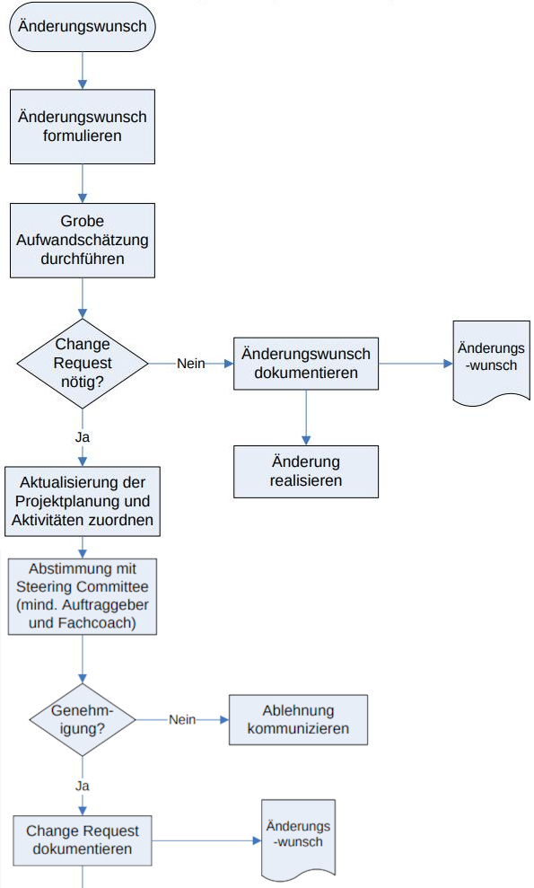
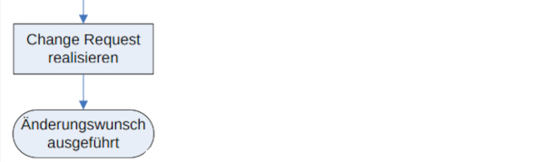

== Projektkontrolle
=== Definition
Unter «Controlling» in einem Projekt verstehen wir mehrere Tätigkeiten:

. Planung
. Kontrolle & Abweichungsanalyse
. Informierung & Berichtswesen
. Steuerung & Koordination

Grundsätzlich geht es darum, den Projektstand zu *ermitteln*, diesen zu *kommunizieren* und allfällige *Änderungen* am Projekt *vorzunehmen*.

footnote:[«Controlling» ist also mehr als nur «kontrollieren».]

=== Wer kontrolliert die Projekte?
Schlussendlich dient das «Controlling» besonders den Entscheidungsträgern in einem Projekt. Diese sind:

* Der *Lenkungsausschuss*, also die Auftraggeber und Kunden (Soll).
* Die *internen Mitarbeiter* wie Projekt-Controller, Audit und Portfolio- und Programm-Manager (Kann).

==== Einschub: Portfolio & Programm
In den meisten Unternehmen gehören Projekte immer einem Programm und darüber einem Portfolio an.

footnote:[Portfolio: Alle Projekte, die ein Unternehmen ausmachen.]
footnote:[Programm: Zusammenhängende Projekte, die eine Teilmenge des Portfolios bilden.]

'''

=== Kontrolle & Abweichungsanalyse
==== Ausgangslage
In einem ersten Schritt müssen wir den aktuellen Projektstand ermitteln. Das bedeutet, wir müssen den *Projektfortschritt* irgendwie *messen*.

==== Methoden
Leider ist es faktisch kaum möglich, den exakten Projektfortschritt zu ermitteln. Wir können aber:

* Das *Produkt* betrachten und dessen Fertigungsgrad bestimmen.
* Die *Entwickler* fragen, wie viel Zeit sie noch benötigen.

footnote:[Unschärfe ist dabei vorprogrammiert.]

==== Messwerte
Um nun den Projektfortschritt bestimmen zu können, messen wir in bestimmten Abständen verschiedene Werte.

footnote:[Wir können so den Projektstand als Trend abbilden.]

===== *1.* Zeit, Kosten, Leistung
Gemäss OTOBOS messen wir mindestens die verbrauchte Zeit, die aktuellen Kosten sowie die erbrachte Leistung.

===== *2.* Earned-Value-Analyse (EVA)
Die EVA ist die bekannteste Messgrösse für den Projektfortschritt. Sie bestimmt den *Fertigstellungswert* eines Projekts, woraus dann die *Kosteneffizienz* abgeleitet werden kann. Die EVA beinhaltet:

* *Planned Cost* (PC)
* *Actual Cost* (AC)
* *Earned Value* (EV)
* *Cost Variance* (CV)
* *Cost Performance Index* (CPI)

[.inlined]
[.smaller]
[.with-padding]
[cols="1,1"]
|===
| stem:[CV = EV - AC]
| stem:[CPI = (EV) / (AC)]
|===

footnote:[Wobei `EV` = Fertigstellungswert, `CPI` = Kosteneffizienz]
footnote:[Kosteneffizienz: Verhältnis der Kosten zur erbrachten Leistung]
footnote:[Wir streben immer eine Kosteneffizienz > 1 an.]

'''

'''

Es gibt *3* Berechnungsmethoden:

. *Strikt*: Alle *vollständig abgeschlossenen* Komponenten werden beachtet.
[.inline-stem]#stem:[EV = K_1 + K_2 + K_3 + ...]#
. *Zwischenresultate*: Alle *brauchbaren* Komponenten werden beachtet.
[.inline-stem]#stem:[EV = K_1.1 + K_1.3 + K_2.2 + ...]#
. *Restaufwand*: Die Berechnung erfolgt über die Schätzung des Restaufwands.
[.inline-stem]#stem:[EV = (PC) / (AC + Rest) * AC]#

footnote:[«Zwischenresultate» sind z.B. Module einer Software.]
footnote:[Bei «Strikt» muss die gesamte Software fertig sein.]

===== *3.* Meilenstein-Trend-Analyse (MTA)
Bei der MTA werden die Deadlines der Projektmeilensteine rückwirkend analysiert. Somit zeigt diese Analyse die *Verschiebungen der Meilensteine* über das Projekt hinweg auf.

footnote:[Optimal sind *keine* Verschiebungen (horizontale Linien).]
footnote:[Diese Analyse zeigt eindrucksvoll den Projektverlauf.]

'''

[.inlined]
[.with-padding]
[.tiny]
[cols="1,1"]
|===
| Gutes Projekt
| Schlechtes Projekt
|===

==== Weiteres
Im Zusammenhang mit dem Projektstand beachtet man auch oft:

* Risiken und Chancen
* Aktuelle Issues
* Restaufwandschätzung
* Kommentare

footnote:[Meistens bestimmt das Unternehmen den Inhalt.]

=== Informierung & Berichtswesen
==== Ausgangslage
Die meisten Projekte scheitern aufgrund *ungenügender Kommunikation*. Um das zu verhindern, benötigen wir im «Controlling» ein robustes Berichtswesen.

'''

==== Kommunikationsvarianten
Die beste Methode für das Erreichen einer guten Kommunikation ist das Umwandeln der ermittelten Werte über den Projektstand in «einfache» Metriken.

footnote:[Dies vereinfacht insbesondere die Kundenkommunikation.]

===== *1.* Definition of Done
Die einfachste Variante ist die Einteilung des Arbeitsfortschritts in einfache Kategorien. Wann etwas «fertig» ist, bestimmen wir dabei selbst.

footnote:[z.B. 0% nicht begonnen, 30% in Arbeit, 80% fertig.]

===== *2.* Ampel-Prinzip
Beim Ampel-Prinzip drücken wir den Projektstand in Form einer Ampel aus. Dies hilft, die aktuelle Situation transparent und klar zu kommunizieren.

image::../assets/signal-prinziple.jpg[signal-prinziple, 160]

footnote:[Jedes Unternehmen hat dabei eine eigene Farbdefinition.]
footnote:[Der Projektleiter muss somit klare Stellung nehmen.]

===== *3.* Aggregiertes Ampel-Prinzip
In Bezug auf OTOBOS können wir auch mehrere Ampeln anhand des maximum Prinzips aggregieren.

footnote:[Maximum Prinzip: Ist etwas Orange, ist alles Orange.]

==== *4.* Cockpit
Ein Projekt Cockpit ist eine Sammlung von verschiedenen Messwerten und Analysen. Es erlaubt uns, den Projektstand schnell zu ermitteln und zu beeinflussen.

=== Steuerung & Koordination
==== Change Management
Kein Projekt wird so durchgeführt, wie es ursprünglich geplant wurde. Um mit Änderungen umzugehen, brauchen wir ein klares «Change Management».

footnote:[Projektplanung bedeutet nicht, die Zukunft vorherzusagen.]
footnote:[Bei agilen Projekten ist dieses Thema nicht relevant.]

'''

==== Vorgehen bei Abweichungen
Bei klassischen Projektmethoden müssen wir bei Abweichungen vom Plan irgendwie handeln. Wir können z.B.:

* Die Vorgehensweise ändern
* Überzeiten anordnen
* Coaching & Unterstützung anfordern

Wenn diese Massnahmen keine Verbesserungen bringen, müssen wir einen «Change Request» beantragen.

footnote:[Die Vorgehensweise ändern heisst z.B. serielle Tätigkeiten in parallele umzuwandeln.]

==== Change Requests
Ein «Change Request» ist eine Anfrage beim Kunden, gewisse Aspekte des Projekts abzuändern. Change Requests müssen immer begründet sein.

footnote:[Meistens ändern wir Aspekte in Bezug auf OTOBOS.]
footnote:[z.B.: Weniger Inhalt, damit das Geld reicht (Scope)]
footnote:[Oftmals ist mehr Budget besser als weniger Scope.]

===== Kategorien
Streng genommen gibt es genau *3* Kategorien von Change Requests: *Scope*, *Budget* und *Time*. In der Praxis sind aber auch weitere Kategorien anzutreffen:

* *Legal Terms*: z.B. Vertragsort
* *Ressourcen*: z.B. Hersteller

===== Voraussetzungen
Um einen Change Request zu stellen, müssen zuerst einige Voraussetzungen erfüllt sein:

. Ein Change-Prozess ist definiert (Wie und an wen muss ich den Request stellen).
. Die Änderung ist fassbar und allen bewusst.
. Die technischen und organisatorischen Voraussetzungen sind erfüllt, wie z.B.:
    * Der Change ist machbar
    * Die Ressourcen sind vorhanden
    * Die Termine sind realistisch
    * etc.

===== Beschreibung eines Changes
In einem Change Request muss sinngemäss die *gewünschte Änderung* beschrieben sein. Die Beschreibung soll dabei:

* Kurz und prägnant sein.
* Sich an die Zielgruppe orientieren.
* Keinen Entscheid erpressen.
* Wahlfreiheit suggerieren.
* Die eingetroffenen Risiken erwähnen.
* Wörter verwenden wie: «Ermöglichen, ausserordentlich, neue Rahmenbedingungen»
* Wörter vermeiden wie: «muss, darf nicht sein, keine Ahnung, aus heiterem Himmel»

===== Auswirkungen und Risiken
Die Auswirkungen und Risiken eines Changes sollten in einem separaten Kapitel beschrieben werden. Dabei sollten u.a. auch diese Punkte erwähnt werden:

* Auswirkungen bei einer Ablehnung
* Neue Risiken bei einer Änderung

===== Quantifizierung
Mit einem Change Request will man oftmals mehr Budget oder Zeit für ein Projekt anfordern. Diese Werte müssen im Request sinnvoll quantifiziert sein.

footnote:[z.B. «Wir benötigen 3 Monate mehr, damit wir...».]
footnote:[Quantifiziere so hoch wie möglich und so tief wie nötig.]
footnote:[Bei neuen Anforderungen immer Budget *und* Zeit erhöhen.]

===== Vorgehen

