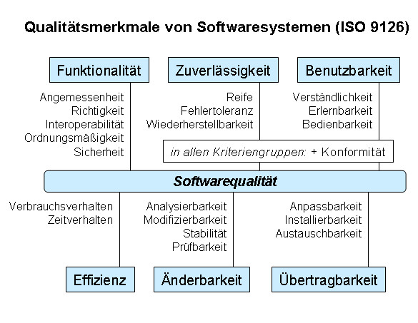
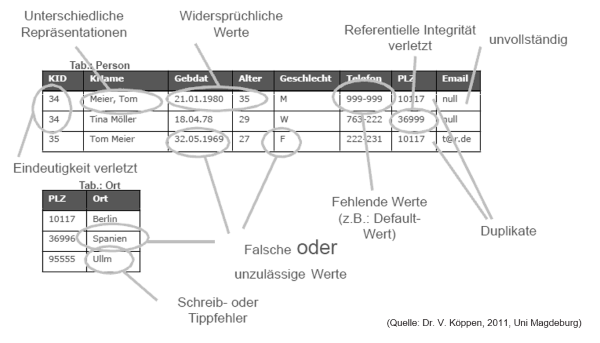
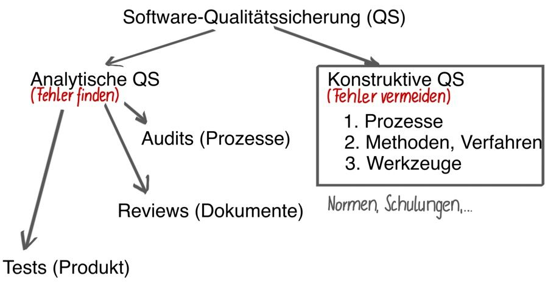
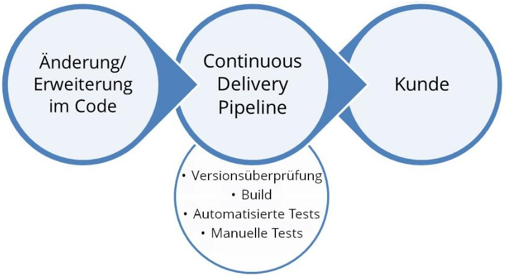
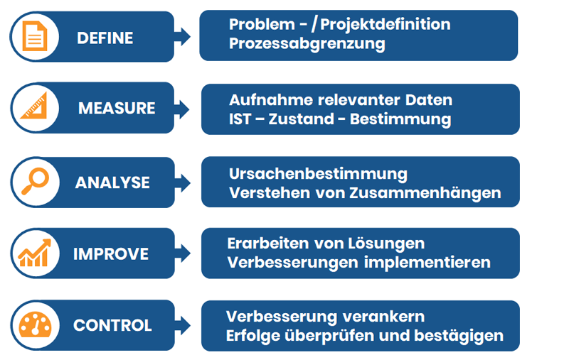
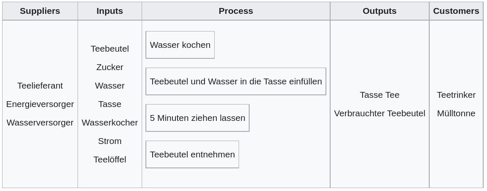
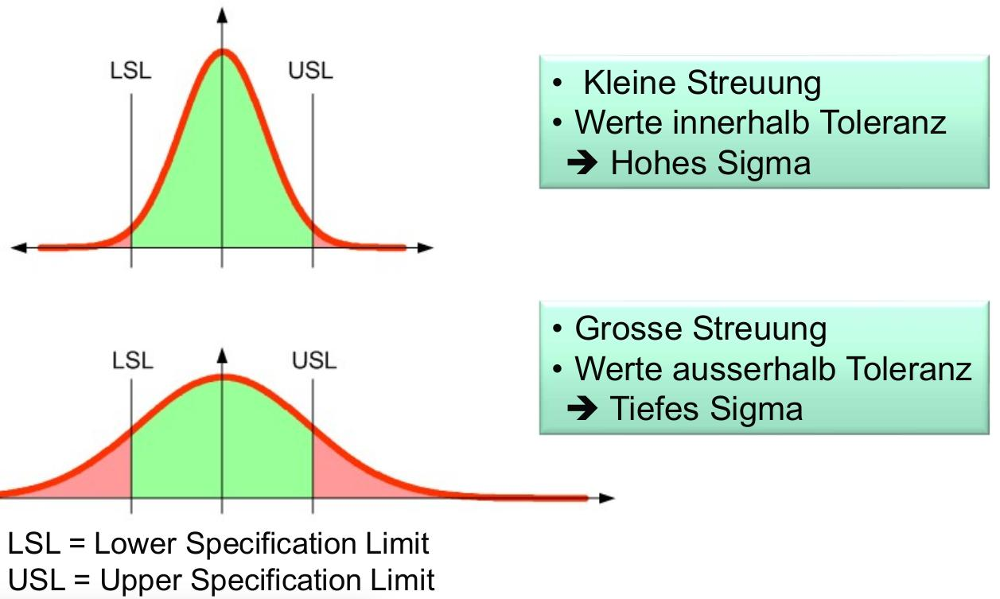

== Qualitätsmanagement
=== Ausgangslage
Der Begriff «Qualität» hat selbst keine Wertung: Qualität kann entweder gut oder schlecht sein. In einem Projekt streben wir selbstverständlich immer gute Qualität an.

footnote:[Der Begriff stammt aus dem Lateinischen: «qualitas».]

==== Softwarequalität
Im Bereich der Softwaresysteme streben wir *6* Qualitätsmerkmale an:

. Funktionalität
. Zuverlässigkeit
. Benutzbarkeit
. Effizienz
. Änderbarkeit
. Übertragbarkeit

Wir sprechen bei diesen Themen auch von *nicht-funktionalen* Anforderungen.

'''

===== Beispiele von Softwarequalität
Wir können uns bei der Softwarequalität z.B. diese Frage stellen:

* *Funktionalität*: Ist der Code sinnvoll strukturiert und getestet?
* *Änderbarkeit*: Ist der Code dokumentiert und modularisiert?
* *Zuverlässigkeit*: Werden Fehler im Code abgefangen und geloggt?
* *Übertragbarkeit*: Kann der Code auf anderen Systemen ausgeführt werden?

==== Informationssicherheit
Ungemein wichtig für Softwaresysteme sind auch die *4* Themen im Bereich der Informationssicherheit:

. *Vertraulichkeit*: Informationen sind nur für erlaubte Personen sichtbar.
. *Integrität*: Informationen sind vor unerlaubten Änderungen geschützt.
. *Verfügbarkeit*: Systeme sind verfügbar, wenn sie gebraucht werden.
. *Vertrauenswürdigkeit*: Transaktionen passieren nur zwischen vertrauten Parteien.

footnote:[Diese 4 Punkte sind in allen Qualitätsmerkmalen in irgendeiner Form anzufinden.]

==== Datenqualität
Daten sind die *wertvollsten* Bestandteile von Softwaresystemen. Bei Daten gilt aber «Garbage in - Garbage out»: Nur mit hoher Datenqualität lassen sich gute Ergebnisse erzielen.

===== Dimensionen
Die Qualität von Daten lassen sich an *5* Faktoren messen:

. Konsistenz
. Gültigkeit
. Vollständigkeit
. Korrektheit
. Aktualität

Die Datenqualität gibt an, wie gut sich die Daten für einen bestimmten Anwendungszweck eignen.

footnote:[Diese Aspekte müssen regelmässig geprüft werden.]
footnote:[z.B. Beim Speichern oder Auswerten der Daten]

'''

===== Massnahmen zur Verbesserung
Diese *5* Massnahmen können die Datenqualität verbessern:

. Definieren der Datenqualität
. Ständiges Messen der Datenqualität
. Stakeholder und Spezialisten einbeziehen: Diese können am besten Bestimmen, ob die Datenqualität stimmt.
. «First Time Right» Ansatz befolgen: Das Nachbessern von Datensätzen ist ineffizient und aufwendig.
. Datensilos vermeiden: Alle Daten sollten einmalig und zentral abgelegt sein.

=== Qualitätssicherung im Projekt
Unter Qualitätssicherung versteht man die strukturierte Prüfung der Qualität in einem Projekt. Dies wird mittels *präventiven* (konstruktiven) und *detektiven* (analytischen) Massnahmen erreicht.

footnote:[Wir wollen also Qualitätsfehler finden und vermeiden.]
footnote:[Es gilt: Je früher die Fehlerbehebung, desto günstiger.]

'''

==== Qualität im Projektmanagement
Das zentrale Mass für die Projektqualität sind die *Erwartungen* des Kunden an die erarbeiteten Ergebnissen. Ein Projektmanager muss immer folgende Punkte beachten:

* *Kundenzufriedenheit*: Ohne Kundenzufriedenheit keine Qualität. Ist der Kunde unzufrieden, spielen Qualitätsmerkmale keine Rolle.
* *Kosten*: Wie viel kostet das Erreichen eines Qualitätsmerkmals und wie viel kostet der Schaden beim Nicht-Erreichen?
* *Verbesserungen*: Wie können die Prozesse und Arbeiten kontinuierlich verbessert werden?

footnote:[Auch: Die Kosten der Konformität und Nicht-Konformität.]

==== Verfahren zur Qualitätsverbesserung
Für die Qualitätsverbesserung können verschiedene Verfahren angewandt werden.

===== *1.* Audits und Reviews
Bei diesem Verfahren werden alle Lieferergebnisse von einer weiteren Person auf Spezifikation und Codequalität überprüft.

footnote:[Dies verbessert neben der Qualität auch die Wartbarkeit.]
footnote:[Kann bis ins Extreme praktiziert werden (Pair-Programming).]

===== *2.* Continuous Delivery
Bei diesem Verfahren wird die Software fortlaufend kompiliert, getestet, verpackt und in die Produktion gestellt.

footnote:[Kleine Schritte reduzieren das Schadenmass von Fehlern.]
footnote:[Dies benötigt ein sinnvolles Versionssystem wie Git.]

'''

===== *3.* Ad absurdum und Negativtests
Bei diesem Verfahren werden bewusst alle Anforderungen und Ergebnisse angezweifelt und hinterfragt.

footnote:[Ist diese Anforderungen wichtig? Oder ist sie unnötig?]
footnote:[Erstellte Testfälle sollen bewusst Fehler auslösen.]

==== QM-Handbuch
Ein gutes QM-Handbuch (How-To) kann dabei helfen, die Qualitätssicherung in einem Projekt sauber durchzuführen. Oft stossen solche Handbücher aber auf diese Probleme:

* Die Ziele sind nichts aussagend
* Die Ziele sind unspezifisch
* Die Ziele sind unvollständig
* Die Ziele sind unkonkret

footnote:[Es gilt: Lieber kein Handbuch als ein schlechtes.]

=== Qualitätssicherung im Unternehmen
==== SixSigma
SixSigma ist ein mathematisches Modell zur Messung und Optimierung von Geschäftsprozessen. Es basiert auf dem DMAIC-Prinzip

footnote:[SixSigma ist unabhängig von Prozess und Branche.]
footnote:[Die Anwendung der Methodiken ist dabei frei.]

'''

===== Define
Bei Define wollen wir das Betrachtungsfeld eingrenzen. Wir können z.B. ein Prozess mittels SIPOC definieren.

footnote:[SIPOC: Suppliers, Inputs, Process, Outputs, Customers]
footnote:[s. Beispiel «Teezubereitung»]

'''

===== Measure
Nun werden die Werte gemessen. Wir können z.B. die Teetrinker (Customers) fragen, ob Sie den Tee gut finden oder nicht. Wir streben dabei einen positiven Wert von *99.99966%* (6σ) an!

footnote:[Wir haben also einen definierten Input und Output.]
footnote:[Dies ist unsere «Formel» mit einem Erwartungswert.]

'''

===== Klassisch vs. SixSigma
Klassisch sind 99% (3.8σ) gut:

* *20'000* verlorene Briefe pro Stunde.
* *5'000* falsche chirurgische Eingriffe pro Woche in Europa.
* *2* Landungen ausserhalb der Rollbahn auf den grössten Flughäfen täglich.

Bei SixSigma sind 99.99966% (6σ) gut:

* *7* verlorene Briefe pro Stunde.
* *1.7* falsche chirurgische Eingriffe pro Woche in Europa.
* *0.0007* Landungen ausserhalb der Rollbahn auf den grössten Flughäfen.

footnote:[Bei SixSigma passieren nur 3.4 Fehler auf eine Million.]

===== Improve
In diesem Schritt werden mit neuem *Wissen*, *Werkzeuge* und *Verhalten* die Aktionen des Unternehmens so angepasst, dass die neuen Messwerte genau in diesem *6σ*-Bereich liegen.

footnote:[z.B. andere Zubereitungsart des Tees.]