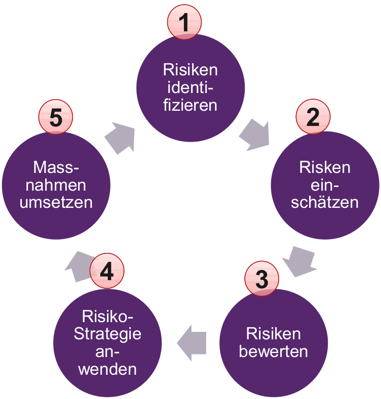
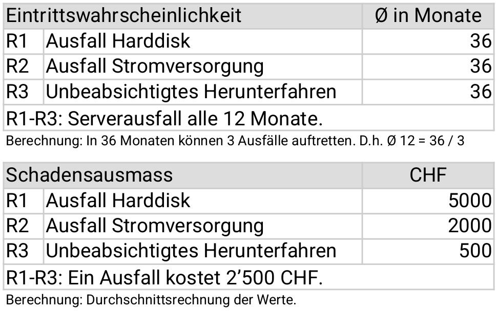
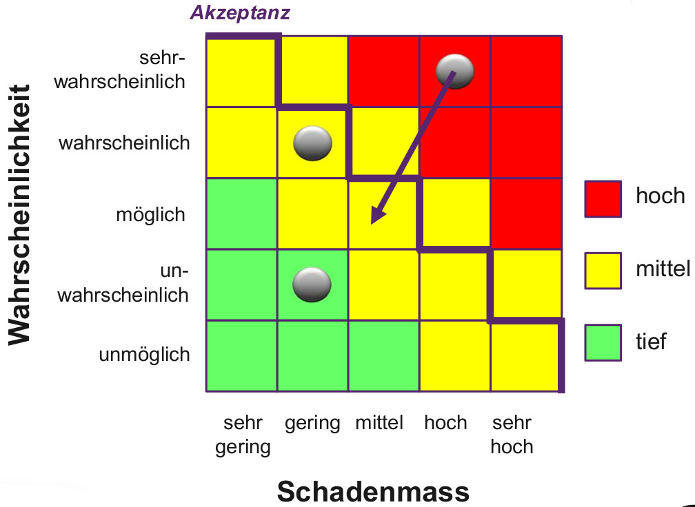

== Risikomanagement
=== Ausgangslage
*Risiken* und *Chancen* sind Unsicherheitsfaktoren in einem Projekt, welche sich positiv oder negativ auf das Ergebnis auswirken können. Die Risikoanalyse ist ein wichtiger Bestandteil des Projektmanagements.

footnote:[Die Chancenanalyse ist seltener, aber hilfreich.]
footnote:[Ein eingetretenes Risiko nennt man auch «Issue».]

==== Bestandteile von Risiken
Ein Risiko besteht aus *2* Faktoren:

* Eintrittswahrscheinlichkeit
* Schadensausmass

footnote:[Diese Faktoren dienen u.a. der Priorisierung von Risiken.]

==== Risikomanagement
Das Risikomanagement selbst kann in *5* Schritte aufgeteilt werden.

=== *1.* Identifizieren
Für die Risikoidentifikation werden in der Praxis meistens diese *4* Analysen angewendet:

* Impact Analyse
* Bedrohungsanalyse
* Schwachstellenanalyse
* Beliebige Kombinationen

Die Kombination von allen 3 Methoden entspricht einer *vollständigen* Analyse.

==== Impact Analyse
Bei der Impact Analyse werden die kritischen *Geschäftsprozesse* und *Infrastrukturen* eines Projekts analysiert und deren Störungen als Risiko formuliert.

==== Bedrohungsanalyse
Bei der Bedrohungsanalyse werden möglichen Bedrohungen aus einem *Bedrohungskatalog* analysiert und die davon relevanten als Risiko formuliert.

==== Schwachstellenanalyse
Bei der Schwachstellenanalyse werden anhand *ähnlicher Projekte* die grössten Schwachstellen identifiziert und dann als Risiko formuliert.

=== *2.* Einschätzen
Jedes Risiko muss entweder *qualitativ* (Hoch, Mittel, Tief) oder *quantitativ* (Zeit, Kosten) eingeschätzt werden. Es gibt *3* Arten, um dies zu tun:

* Schätzung der maximalen Werte
* Schätzung der mittleren Werte
* Schätzung via statistischer Verteilfunktion

Im Normalfall wird zuerst die Eintrittswahrscheinlichkeit und dann das Schadensausmass geschätzt.

footnote:[Dies kann «Bottom-Up» oder «Top-Down» gemacht werden.]
footnote:[Bottom-Up: Zuerst Detailanalyse, dann Übersicht.]
footnote:[Top-Down: Zuerst Übersicht, dann Detailanalyse.]

==== Beispiel «Serverausfall»

footnote:[Wir verwenden meist den MTBF (Mean Time between Failure).]

=== *3.* Bewertung
Bei der Risikobewertung werden Risiken in einen Kontext gebracht und wenn möglich *terminlich* fixiert oder *priorisiert*. Man verwendet dazu *2* Methoden.

==== *1.* Risikoliste
Die Risikoliste ist eine Sammlung von allen identifizierten Risiken. Sie beinhaltet meistens:

* Risiko (mit ID)
* Massnahmen
* Kosten der Massnahmen
* Schadensausmass (Kosten)
* Eintrittswahrscheinlichkeit
* Gewichteter Schaden
* Priorität / Termin

footnote:[Dies ist wie eine «Lebensversicherung».]

==== *2.* Risikograph / Risikomatrix
Anhand der Risikoliste können die Risiken nun in einen *Risikograph* eingetragen werden. Die meisten Unternehmen definieren dabei eine sogenannte *Akzeptanzlinie*, unter welcher alle Risiken liegen müssen.

footnote:[Risiken darüber müssen entsprechend reduziert werden.]

'''

==== Beispiele von Risiken
Bekannte Risiken sind:

* Personelle Defizite (Quantität & Qualität)
* Unrealistische Termine und Kosten
* Entwicklung von falschen Funktionen
* Entwicklung der falschen Schnittstellen
* Vergolden vom Projekt
* Ständige Anforderungsänderungen
* Defizite bei externen Komponenten
* Defizite bei externen Aufgaben
* Defizite in der Echtzeitleistung
* Überfordern der Softwaretechnik

footnote:[In den Vorlesungsunterlagen finden sich noch mehr.]
footnote:[Die «20 Fehler nach Lindecker» sind sehr ähnlich.]

=== *4.* Bewältigung
Um ein Risiko zu bewältigen, können wir eine oder mehrere der folgenden *4* Methoden anwenden:

. *Vermeiden*: z.B. eine risikoreiche Methodik durch eine andere ersetzen.
. *Vermindern*: z.B. Schulungen in einem bestimmten Bereich durchführen.
. *Überwälzen*: z.B. eine entsprechende Versicherung abschliessen.
. *Selbst tragen*: z.B. den Schaden beim Eintritt akzeptieren und abzahlen.

footnote:[Überwälzen bedeutet, das Risiko auf andere zu übertragen.]
footnote:[Merke: Es bleibt immer ein Restrisiko vorhanden!]

=== *5.* Massnahmen
Grundsätzlich gilt: Eine Massnahme soll nicht teurer sein, als das Risiko selbst. *Wenige* aber *griffige* Massnahmen sind dabei vom Vorteil. Einige Taktiken sind:

* Risiken mit hoher Eintrittswahrscheinlichkeit vermeiden.
* Risiken mit hohem Schadensausmass vermindern.
* Seltene Risiken überwälzen.
* Für alle anderen Risiken eine zeitliche / finanzielle Projektreserve bereitstellen.

footnote:[Risiken ohne gute Massnahmen sollen akzeptiert werden.]
footnote:[Es lassen sich auch Eintrittsmassnahmen definieren.]

==== Beispiele von Massnahmen
Einige Massnahmen sind:

* Gegen *Personalausfall*: Jeder Projektmitarbeitende hat einen Stellvertreter und informiert diesen wöchentlich über den aktuellen Stand.
* Gegen *schlechte Datenqualität*: Zusätzliche Tests überprüfen systematisch die Inhalte der Datenbank.
* Gegen *unklare Anforderungen*: Zusätzliche Meetings mit dem Kunden werden angesetzt.

=== Chancen
Chancen sind das *Gegenteil* von Risiken. Es lohnt sich, mögliche Chancen zu identifizieren und deren Eintrittswahrscheinlichkeit und Nutzen zu bestimmen. Typische Chancen sind:

* Neue Hardware-Generationen machen Tuning überflüssig.
* Bestimmte Klassen werden auch von anderen Kunden benötigt.
* Benötigte Hardware trifft früher ein.

footnote:[Man kann dies auch in eine SWOT-Analyse verpacken.]